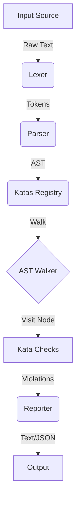

# Developer guide

This document covers the architecture, contribution workflow, and release lifecycle.

## Contents

- [Getting started](#getting-started)
- [Development workflow](#development-workflow)
- [Architecture overview](#architecture-overview)
- [AST reference](#ast-reference)
- [Release process](#release-process)
- [Project governance](#project-governance)

---

## Getting started

### Prerequisites

- **Go** 1.25 or higher.
- **Git** for version control.
- **Make** (optional) for running build scripts.

### Setup

1. Clone the repository.
   ```bash
   git clone https://github.com/afadesigns/zshellcheck.git
   cd zshellcheck
   ```

2. Install dependencies.
   ```bash
   go mod download
   ```

## Development workflow

### Building

Recommended — use the installer script to build and install locally; it auto-detects the source repo:

```bash
./install.sh
```

Manual build:

```bash
go build ./cmd/zshellcheck
```

### Running tests

The project uses the standard Go testing framework.

Run every test:

```bash
go test ./...
```

Run a specific test file:

```bash
go test -v pkg/parser/parser_test.go
```

Run the integration test against real Zsh scripts:

```bash
./tests/integration_test.zsh
```

### Creating a new kata

1.  **Identify the anti-pattern.** It must be **Zsh-specific** — generic POSIX-sh issues belong in ShellCheck, not here.
2.  **Determine the AST node.** See the [AST Reference](#ast-reference) below.
3.  **Grep existing katas** to avoid duplication: `grep -rn 'Title:' pkg/katas/ | grep -i '<keyword>'`.
4.  **Scaffold the detection file** `pkg/katas/zc<NNNN>.go`:

    ```go
    package katas

    import "github.com/afadesigns/zshellcheck/pkg/ast"

    func init() {
        RegisterKata(ast.SimpleCommandNode, Kata{
            ID:          "ZCXXXX",
            Title:       "Avoid `foo` — prefer `${bar:h}`",
            Description: "Foo is a bash-ism; Zsh provides `${bar:h}` natively.",
            Severity:    SeverityStyle,
            Check:       checkZCXXXX,
        })
    }

    func checkZCXXXX(node ast.Node) []Violation {
        cmd, ok := node.(*ast.SimpleCommand)
        if !ok {
            return nil
        }
        ident, ok := cmd.Name.(*ast.Identifier)
        if !ok {
            return nil
        }
        if ident.Value != "foo" {
            return nil
        }
        return []Violation{{
            KataID:  "ZCXXXX",
            Message: "Avoid `foo` — use `${bar:h}`.",
            Line:    cmd.Token.Line,
            Column:  cmd.Token.Column,
            Level:   SeverityStyle,
        }}
    }
    ```

    **Never `panic()` in `Check`.** Always use `ok`-checked type assertions. A kata panic kills the entire linter run. Return `nil` (not an empty slice) when no violations.

5.  **Write tests** in `pkg/katas/katatests/zc<NNNN>_test.go` covering at least one violation case and one no-violation case.

6.  **Once committed, fix — don't remove.** Retire duplicates as no-op stubs (see `ZC1018`, `ZC1022` for the pattern).

### Adding an auto-fix

A kata becomes auto-fixable when its rewrite is **context-free, idempotent, and byte-exact**.
The auto-fixer runs every kata's `Fix` function over the source; conflicting overlaps resolve outer-wins on the first pass, with the inner edit picked up on a subsequent pass.
The fixer caps at five passes by default so nested rewrites converge in a single `-fix` invocation.

Set the `Fix` field on the kata struct alongside `Check`:

```go
RegisterKata(ast.SimpleCommandNode, Kata{
    ID:          "ZCXXXX",
    Title:       "...",
    Severity:    SeverityWarning,
    Check:       checkZCXXXX,
    Fix:         fixZCXXXX,
})
```

The `Fix` signature is:

```go
func fixZCXXXX(node ast.Node, v Violation, source []byte) []FixEdit
```

Return a slice of `FixEdit` — each carrying a 1-based `Line` + `Column`, a byte-span `Length` to replace, and the replacement string.
`pkg/katas/fixutil.go` exposes `LineColToByteOffset` and related helpers that handle multi-byte UTF-8 alignment.

If the rewrite cannot be made safe (the offending span depends on surrounding context, the new code might shift semantics, or the kata is advisory rather than mechanical), **leave `Fix` nil**.
Detection-only katas remain valuable.

#### Catalog of shipped rewrite shapes

| Pattern | Example | Reference kata |
| --- | --- | --- |
| Token substitution (single byte span) | `` `cmd` `` → `$(cmd)` | `ZC1002` |
| Identifier rename | `which` → `whence` | `ZC1005` |
| Command + flag collapse | `echo -E …` → `print -r …` | `ZC1355` |
| Parameter-name rename | `$BASH_ALIASES` → `$aliases` | `ZC1313` |
| Quote-insertion around an expansion | `rm -rf $var` → `rm -rf "$var"` | `ZC1075` |

When a new kata introduces a rewrite shape that doesn't fit one of these, extend the table in the same PR so the catalog stays current.

### Severity levels

Every kata must declare a severity via the Go constants `SeverityError`, `SeverityWarning`, `SeverityInfo`, or `SeverityStyle` defined in `pkg/katas/katas.go`.
See the [severity levels reference](USER_GUIDE.md#severity-levels) for the rubric and when to pick each level.

---

## Architecture overview

ZShellCheck follows a standard static-analysis pipeline:



### Core components

1. **Lexer (`pkg/lexer`).**
   Scans source code into a stream of tokens.
   Handles Zsh-specific quoting and expansions.
2. **Parser (`pkg/parser`).**
   Consumes tokens to build an abstract syntax tree.
   Recursive-descent.
3. **AST (`pkg/ast`).**
   Defines the tree structure: nodes, statements, expressions.
4. **Katas (`pkg/katas`).**
   The check rules.
   Each kata registers against one or more AST node types.
5. **Reporter (`pkg/reporter`).**
   Formats violations as text, JSON, or SARIF.
   Honours `-severity` filtering and `-no-color`.

---

## AST reference

The kata API is built around AST nodes.

### Common node types

**Statements**
- **`SimpleCommandNode`** — basic command: `ls -la`.
  Fields: `Name` (Expression), `Arguments` ([]Expression), `Redirections`.
- **`IfStatementNode`** — `if … then … elif … else … fi`.
  Fields: `Condition`, `Consequence`, `Alternative`.
- **`WhileLoopStatementNode`** — `while … do … done`.
  Fields: `Condition`, `Body`.
- **`ForLoopStatementNode`** — both `for x in …` and C-style `for ((init; cond; post))`.
  Fields: `Init`, `Condition`, `Post`, `Items`, `Body`.
- **`CaseStatementNode`** — `case … in … esac`.
  Fields: `Subject`, `Cases`.
- **`FunctionDefinitionNode`** — `name() { … }` and `function name { … }`.
  Fields: `Name`, `Params`, `Body`.
-   **`BlockStatementNode`** — statement lists.
-   **`LetStatementNode`** — `let x=1`.
-   **`DeclarationStatementNode`** — `typeset`, `declare`, `local`, `readonly`, `export`.
-   **`SubshellNode`** — `( … )`.
-   **`ArithmeticCommandNode`** — `(( … ))`.

**Expressions**
-   **`IdentifierNode`** — bare words.
-   **`StringLiteralNode`** — quoted strings.
-   **`InfixExpressionNode`** — binary ops and command chains (`&&`, `||`, `|`).
-   **`PrefixExpressionNode`** — unary ops.
-   **`CommandSubstitutionNode`** — backticks `` `…` ``.
-   **`DollarParenExpressionNode`** — `$(…)`.
-   **`ArrayAccessNode`** — `${arr[key]}`.
-   **`InvalidArrayAccessNode`** — bare `$arr[key]` (raised as a kata, not a parser error).
-   **`BracketExpressionNode`** — `[ … ]`.
-   **`DoubleBracketExpressionNode`** — `[[ … ]]`.
-   **`RedirectionNode`** — wraps a statement with `>`, `<`, `>>`, `<<`, `>&`, `<&`.

Not every Zsh construct has its own node yet.
Known gaps: parameter-expansion modifiers `${var:-default}` / `${var##glob}` (tracked in [#129](https://github.com/afadesigns/zshellcheck/issues/129)).

### Visitor pattern

Use `ast.Walk` to traverse the tree:

```go
ast.Walk(rootNode, func(node ast.Node) bool {
    if cmd, ok := node.(*ast.SimpleCommand); ok {
        // Inspect command...
    }
    return true // Continue traversal
})
```

---

## Release process

ZShellCheck follows standard [semantic versioning](https://semver.org) since v1.0.10.
`pkg/version/version.go` is hand-maintained; the legacy kata-count formula is retired.
Tags are cut manually by the maintainer.

In the steps below, substitute `vX.Y.Z` for the new release version (e.g. `v1.0.16`).

1.  **Hand-bump** `pkg/version/version.go`:
    ```go
    const Version = "X.Y.Z"
    ```
2.  **Update** `CHANGELOG.md` with a new `[X.Y.Z] - YYYY-MM-DD` section.
3.  **Commit** the bump via PR → merge to main:
    ```bash
    git switch -c chore/bump-vX.Y.Z
    git add pkg/version/version.go CHANGELOG.md
    git commit -S -m "chore: bump version to X.Y.Z"
    git push -u origin chore/bump-vX.Y.Z
    gh pr create --fill && gh pr merge --squash --auto
    ```
4.  **Sign + push the tag** at the merge SHA:
    ```bash
    git switch main && git pull --ff-only
    git tag -s vX.Y.Z $(git rev-parse main) -m 'vX.Y.Z'
    git push origin vX.Y.Z
    ```
5.  **Release workflow fires** on tag push: GoReleaser builds signed binaries for Linux/macOS/Windows × x86_64/arm64/i386, attaches cosign signatures + SBOMs, and publishes SLSA provenance.
6. **Release title** = tag name only (e.g.
   `vX.Y.Z`).
   No descriptive suffix.

### Gotchas

- Commit bodies must not contain the literal strings `#patch`, `#minor`, or `#major`.
  Release Drafter matches these as version-bump keywords and creates ghost drafts.
  Use `#none` as a safety directive when phrasing risks a match.
- Tags must be signed with `-s`.
  The required GPG key is `B5690EEEBB952194`.
- Never force-push `main`.
  For feature branches that have fallen behind, merge-forward; do not rebase.

---

## Project governance

See [REFERENCE.md](REFERENCE.md) for roles and decision making.