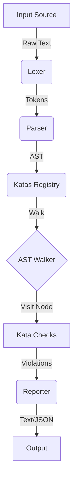

# Developer Guide

This document serves as the comprehensive manual for contributing to the ZShellCheck codebase, understanding its internal architecture, and managing the release lifecycle.

## Table of Contents

- [Getting Started](#getting-started)
- [Development Workflow](#development-workflow)
- [Architecture Overview](#architecture-overview)
- [AST Reference](#ast-reference)
- [Release Process](#release-process)
- [Project Governance](#project-governance)

---

## Getting Started

### Prerequisites

- **Go**: Version 1.25 or higher.
- **Git**: For version control.
- **Make** (Optional): For running build scripts if available.

### Setup

1.  **Clone the repository:**
    ```bash
    git clone https://github.com/afadesigns/zshellcheck.git
    cd zshellcheck
    ```

2.  **Install dependencies:**
    ```bash
    go mod download
    ```

## Development Workflow

### Building

**Recommended:** Use the installer script to build and install locally (auto-detects source repo):
```bash
./install.sh
```

**Manual Build:**
```bash
go build ./cmd/zshellcheck
```

### Running Tests

We use the standard Go testing framework.

- **Run all tests:**
  ```bash
  go test ./...
  ```

- **Run specific tests:**
  ```bash
  go test -v pkg/parser/parser_test.go
  ```

- **Integration Tests:**
  Run against real Zsh scripts.
  ```bash
  ./tests/integration_test.zsh
  ```

### Creating a New Kata

1.  **Identify the anti-pattern.** It must be **Zsh-specific** — generic POSIX-sh issues belong in ShellCheck, not here.
2.  **Determine the AST node.** See the [AST Reference](#ast-reference) below.
3.  **Grep existing katas** to avoid duplication: `grep -rn 'Title:' pkg/katas/ | grep -i '<keyword>'`.
4.  **Scaffold the detection file** `pkg/katas/zc<NNNN>.go`:

    ```go
    package katas

    import "github.com/afadesigns/zshellcheck/pkg/ast"

    func init() {
        RegisterKata(ast.SimpleCommandNode, Kata{
            ID:          "ZCXXXX",
            Title:       "Avoid `foo` — prefer `${bar:h}`",
            Description: "Foo is a bash-ism; Zsh provides `${bar:h}` natively.",
            Severity:    SeverityStyle,
            Check:       checkZCXXXX,
        })
    }

    func checkZCXXXX(node ast.Node) []Violation {
        cmd, ok := node.(*ast.SimpleCommand)
        if !ok {
            return nil
        }
        ident, ok := cmd.Name.(*ast.Identifier)
        if !ok {
            return nil
        }
        if ident.Value != "foo" {
            return nil
        }
        return []Violation{{
            KataID:  "ZCXXXX",
            Message: "Avoid `foo` — use `${bar:h}`.",
            Line:    cmd.Token.Line,
            Column:  cmd.Token.Column,
            Level:   SeverityStyle,
        }}
    }
    ```

    **Never `panic()` in `Check`.** Always use `ok`-checked type assertions. A kata panic kills the entire linter run. Return `nil` (not an empty slice) when no violations.

5.  **Write tests** in `pkg/katas/katatests/zc<NNNN>_test.go` covering at least one violation case and one no-violation case.

6.  **Once committed, fix — don't remove.** Retire duplicates as no-op stubs (see `ZC1018`, `ZC1022` for the pattern).

### Severity Levels

Every kata must declare a severity via the Go constants `SeverityError`, `SeverityWarning`, `SeverityInfo`, `SeverityStyle` (defined in `pkg/katas/katas.go`). See the [Severity Levels reference](USER_GUIDE.md#severity-levels) for the rubric and when to pick each level.

---

## Architecture Overview

ZShellCheck follows a standard static analysis pipeline:



### Core Components

1.  **Lexer (`pkg/lexer`)**: Scans source code into a stream of **Tokens**. Handles Zsh-specific quoting and expansions.
2.  **Parser (`pkg/parser`)**: Consumes tokens to build an **Abstract Syntax Tree (AST)**. Implements a recursive descent parser.
3.  **AST (`pkg/ast`)**: Defines the tree structure (Nodes, Statements, Expressions).
4.  **Katas (`pkg/katas`)**: The check rules. Each Kata registers to listen for specific AST Node types.
5.  **Reporter (`pkg/reporter`)**: Formats violations into Text, JSON, or SARIF output. Supports `--severity` filtering and `--no-color` mode.

---

## AST Reference

Understanding AST nodes is crucial for writing Katas.

### Common Node Types

**Statements**
-   **`SimpleCommandNode`** — basic command: `ls -la`. Fields: `Name` (Expression), `Arguments` ([]Expression), `Redirections`.
-   **`IfStatementNode`** — `if … then … elif … else … fi`. Fields: `Condition`, `Consequence`, `Alternative`.
-   **`WhileLoopStatementNode`** — `while … do … done`. Fields: `Condition`, `Body`.
-   **`ForLoopStatementNode`** — both `for x in …` and C-style `for ((init; cond; post))`. Fields: `Init`, `Condition`, `Post`, `Items`, `Body`.
-   **`CaseStatementNode`** — `case … in … esac`. Fields: `Subject`, `Cases`.
-   **`FunctionDefinitionNode`** — `name() { … }` and `function name { … }`. Fields: `Name`, `Params`, `Body`.
-   **`BlockStatementNode`** — statement lists.
-   **`LetStatementNode`** — `let x=1`.
-   **`DeclarationStatementNode`** — `typeset`, `declare`, `local`, `readonly`, `export`.
-   **`SubshellNode`** — `( … )`.
-   **`ArithmeticCommandNode`** — `(( … ))`.

**Expressions**
-   **`IdentifierNode`** — bare words.
-   **`StringLiteralNode`** — quoted strings.
-   **`InfixExpressionNode`** — binary ops and command chains (`&&`, `||`, `|`).
-   **`PrefixExpressionNode`** — unary ops.
-   **`CommandSubstitutionNode`** — backticks `` `…` ``.
-   **`DollarParenExpressionNode`** — `$(…)`.
-   **`ArrayAccessNode`** — `${arr[key]}`.
-   **`InvalidArrayAccessNode`** — bare `$arr[key]` (raised as a kata, not a parser error).
-   **`BracketExpressionNode`** — `[ … ]`.
-   **`DoubleBracketExpressionNode`** — `[[ … ]]`.
-   **`RedirectionNode`** — wraps a statement with `>`, `<`, `>>`, `<<`, `>&`, `<&`.

Not every Zsh construct has its own node yet. Known gaps: parameter-expansion modifiers `${var:-default}` / `${var##glob}` (tracked in [#129](https://github.com/afadesigns/zshellcheck/issues/129)).

### Visitor Pattern

Use `ast.Walk` to traverse the tree:

```go
ast.Walk(rootNode, func(node ast.Node) bool {
    if cmd, ok := node.(*ast.SimpleCommand); ok {
        // Inspect command...
    }
    return true // Continue traversal
})
```

---

## Release Process

Since v1.0.10 ZShellCheck follows standard [semantic versioning](https://semver.org) and `pkg/version/version.go` is **hand-maintained** — the kata-count formula is retired. Tags are cut **manually** by the maintainer.

1.  **Hand-bump** `pkg/version/version.go`:
    ```go
    const Version = "1.0.14"
    ```
2.  **Update** `CHANGELOG.md` with a new `[1.0.14] - YYYY-MM-DD` section.
3.  **Commit** the bump via PR → merge to main:
    ```bash
    git switch -c chore/bump-v1.0.14
    git add pkg/version/version.go CHANGELOG.md
    git commit -S -m "chore: bump version to 1.0.14"
    git push -u origin chore/bump-v1.0.14
    gh pr create --fill && gh pr merge --squash --auto
    ```
4.  **Sign + push the tag** at the merge SHA:
    ```bash
    git switch main && git pull --ff-only
    git tag -s v1.0.14 $(git rev-parse main) -m 'v1.0.14'
    git push origin v1.0.14
    ```
5.  **Release workflow fires** on tag push: GoReleaser builds signed binaries for Linux/macOS/Windows × x86_64/arm64/i386, attaches cosign signatures + SBOMs, and publishes SLSA provenance.
6.  **Release title** = tag name only (e.g. `v1.0.14`). No descriptive suffix.

### Gotchas

-   Commit bodies must **not** contain the literal strings `#patch`, `#minor`, or `#major` — Release-Drafter matches these as version-bump keywords and will create ghost drafts. Use `#none` as a safety directive when the phrasing risks a match.
-   Tags must be **signed** (`-s`). The required GPG key is `B5690EEEBB952194`.
-   Never force-push `main`. For behind feature branches use merge-forward, not rebase.

---

## Project Governance

See [REFERENCE.md](REFERENCE.md) for details on roles and decision making.